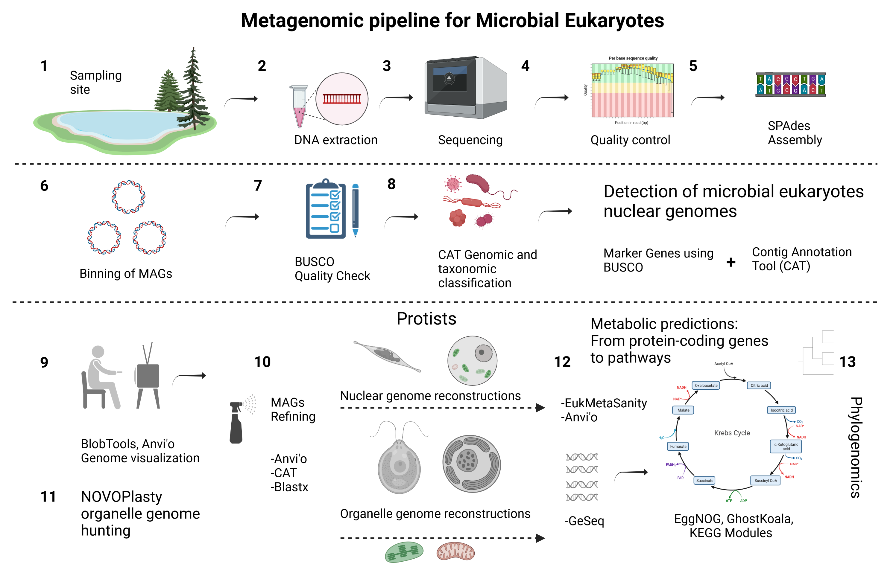

# *Near-complete genome of Chlorella-like microbial eukaryote reveals its potential for carbon, sulphur and nitrogen metabolism in high alpine Meromictic Lake Cadagno*
Publication under review (Saini et al. ISMEJ 2022)
##   Microbial Eukaryotes Metagenomics Pipeline 

### Introduction
Meromictic Lake Cadagno is situated at 1921 m within Swiss Alps. Lake Cadagno is permanently stratisfied into three zones called 1) mixolimnion (upper oxic), 2) monimolimnion (lower anoxic), and 3) in between oxic-anoxic interface called chemocline which harbours a persistent microbial bloom. This study focussed on eukaryotic microbes, and investigated the microbial bloom using Shotgun DNA metagenomics (Illumina HighSeq 4000). Following steps (1-13) were performed to get the near complete genome of Chlorella-like microbial eukaryote. 

#### 1-3 Sample collection, Pre-processing, and assembly of raw reads
For metagenomics sequencing, 20L lake water was collected from the chemocline (oxic-anoxic boundry; 13-15.5 m) of Lake Cadagno. The biomass was captured on 0.2μm filters, and after DNA extractions samples were sent for Shotgun sequencing. The following steps were performed to obtain the near-complete genome of Chlorella-like microbial eukaryote. 

#### 4-5 Pre-processing, and assembly of raw reads
> Required tools with installation links: Anvio: https://anvio.org/install/  | BBtools https://jgi.doe.gov/data-and-tools/software-tools/bbtools/ | Spades https://github.com/ablab/spades 

 - 4.1 Trimming of reads prior to assembly to remove low quality calls
   
            bbduk.sh in1=read1.fq in2=read2.fq out1=clean1.fq out2=clean2.fq

 - 4.2 Error-correction and normalization of reads
            
            bbnorm.sh in=<input> out=<reads to keep> outt=<reads to toss> hist=<histogram output>
 
 - 5.1 Assembly of raw reads using SPAdes 

            spades.py -1 R1.fastq -2 R2.fastq -o name_of_output_folder -t 32 --meta
  
 - 5.2 Contig names were simplified using Anvio with minimum length of 1KB 

            anvi-script-reformat-fasta ./spades.contigs.fasta -o ./renamed.contigs.fa --min-len 1000 --simplify-names --report ./Spades_13m/name_conversions.txt

#### 6 Competitive and Non Competitive Binning from Assemblies 

##### 6.1 CONCOCT based competitive binning using Anvio

> Required tools with installation links: Anvio: https://anvio.org/install/ | Concoct https://anaconda.org/bioconda/concoct | Bowtie2 and Samtools (Already installed with Anvio). 

- Following is the example of Spades Assembly of 15.5m sample of Lake Cadagno mapped to different samples (5m, 9m, 11m, 13m, 15mw, 15mm, 15.5m, 17m). There are total of eight metagenomics samples collected from the Lake. Four samples are from the chemocline (13m, 15mw, 15mm, 17m).
      
      bowtie2-build ../Anvio.15_5m.S.contigs.fa   ./Anvio.15_5m.S.contigs
      
      #15.5m Assembly mapped to 5m sample raw reads
      bowtie2 --threads 32 -x ./Anvio.15_5m.S.contigs -1 Sample_119834_R1.fastq \
                                              -2 Sample_119834_R2.fastq \
                                               -S lib_15_5m_mapped_5m_r.sam
      samtools view -F 4 -bS lib_15_5m_mapped_5m_r.sam > lib_15_5m_mapped_5m_r-RAW.bam
      
      #15.5m Assembly mapped to 9m sample raw reads
      bowtie2 --threads 32 -x ./Anvio.15_5m.S.contigs -1 Sample_119835_R1.fastq \
                                              -2 Sample_119835_R2.fastq \
                                               -S lib_15_5m_mapped_9m_r.sam
      samtools view -F 4 -bS lib_15_5m_mapped_9m_r.sam > lib_15_5m_mapped_9m_r-RAW.bam
      
      #15.5m Assembly mapped to 11m sample raw reads
      bowtie2 --threads 32 -x ./Anvio.15_5m.S.contigs -1 Sample_119836_R1.fastq \
                                                -2 Sample_119836_R2.fastq \
                                                -S lib_15_5m_mapped_11m_r.sam
      samtools view -F 4 -bS lib_15_5m_mapped_11m_r.sam > lib_15_5m_mapped_11m_r-RAW.bam
      
      
      #15.5m Assembly mapped to 13m sample raw reads
      bowtie2 --threads 32 -x ./Anvio.15_5m.S.contigs -1 Sample_119837_R1.fastq \
                                                -2 Sample_119837_R2.fastq \
                                               -S lib_15_5m_mapped_13m_r.sam                                 
      samtools view -F 4 -bS lib_15_5m_mapped_13m_r.sam > lib_15_5m_mapped_13m_r-RAW.bam
      
      #15.5m Assembly mapped to 15mw sample raw reads (whole water sample)
      bowtie2 --threads 32 -x ./Anvio.15_5m.S.contigs -1 Sample_119838_R1.fastq \
                                                -2 Sample_119838_R2.fastq \
                                                -S lib_15_5m_mapped_15mw_r.sam
      samtools view -F 4 -bS lib_15_5m_mapped_15mw_r.sam > lib_15_5m_mapped_15mw_r-RAW.bam

      #15.5m Assembly mapped to 15mm sample raw reads 
      bowtie2 --threads 32 -x ./Anvio.15_5m.S.contigs -1 Sample_119839_R1.fastq \
                                                     -2 Sample_119839_R2.fastq \
                                               -S lib_15_5m_mapped_15mm_r.sam
      samtools view -F 4 -bS lib_15_5m_mapped_15mm_r.sam > lib_15_5m_mapped_15mm_r-RAW.bam
      
      #15.5m Assembly mapped to 15.5m sample raw reads 
      bowtie2 --threads 32 -x ./Anvio.15_5m.S.contigs -1 Sample_119840_R1.fastq \
                                                -2  Sample_119840_R2.fastq \
                                                -S lib_15_5m_mapped_15_5m_r.sam
      samtools view -F 4 -bS lib_15_5m_mapped_15_5m_r.sam > lib_15_5m_mapped_15_5m_r-RAW.bam

      #15.5m Assembly mapped to 17m sample raw reads 
      bowtie2 --threads 32 -x ./Anvio.15_5m.S.contigs -1 Sample_119841_R1.fastq \
                                                     -2 Sample_119841_R2.fastq \
                                                     -S lib_15_5m_mapped_17m_r.sam
      samtools view -F 4 -bS lib_15_5m_mapped_17m_r.sam > lib_15_5m_mapped_17m_r-RAW.bam

      #Sorting RAW bam using Anvio
       anvi-init-bam lib_15_5m_mapped_15mw_r-RAW.bam -o lib_15_5m_mapped_15mw_r.bam
       anvi-init-bam lib_15_5m_mapped_15mm_r-RAW.bam -o lib_15_5m_mapped_15mm_r.bam
       anvi-init-bam lib_15_5m_mapped_15_5m_r-RAW.bam -o lib_15_5m_mapped_15_5m_r.bam
       anvi-init-bam lib_15_5m_mapped_17m_r-RAW.bam -o lib_15_5m_mapped_17m_r.bam
       anvi-init-bam lib_15_5m_mapped_9m_r-RAW.bam -o lib_15_5m_mapped_9m_r.bam
       anvi-init-bam lib_15_5m_mapped_5m_r-RAW.bam -o lib_15_5m_mapped_5m_r.bam
       anvi-init-bam lib_15_5m_mapped_13m_r-RAW.bam -o lib_15_5m_mapped_13m_r.bam
       anvi-init-bam lib_15_5m_mapped_11m_r-RAW.bam -o lib_15_5m_mapped_11m_r.bam

      #Generating Anvio profiles using BAM files

       anvi-profile -i lib_15_5m_mapped_11m_r.bam -c ../Anvio.15_5m.S.contigs.db -T 32
       anvi-profile -i lib_15_5m_mapped_13m_r.bam -c ../Anvio.15_5m.S.contigs.db  -T 32
       anvi-profile -i lib_15_5m_mapped_15mm_r.bam -c ../Anvio.15_5m.S.contigs.db -T 32
       anvi-profile -i lib_15_5m_mapped_15mw_r.bam -c ../Anvio.15_5m.S.contigs.db  -T 32
       anvi-profile -i lib_15_5m_mapped_15_5m_r.bam -c ../Anvio.15_5m.S.contigs.db  -T 32
       anvi-profile -i lib_15_5m_mapped_17m_r.bam -c ../Anvio.15_5m.S.contigs.db  -T 32
       anvi-profile -i lib_15_5m_mapped_5m_r.bam -c ../Anvio.15_5m.S.contigs.db  -T 32
       anvi-profile -i lib_15_5m_mapped_9m_r.bam -c ../Anvio.15_5m.S.contigs.db - -T 32
 
       anvi-merge ./lib_15_5m_mapped_5m_r/PROFILE.db ./lib_15_5m_mapped_9m_r/PROFILE.db ./lib_15_5m_mapped_11m_r/PROFILE.db ./lib_15_5m_mapped_13m_r/PROFILE.db \
          ./lib_15_5m_mapped_15mm_r/PROFILE.db  ./lib_15_5m_mapped_15mw_r/PROFILE.db ./lib_15_5m_mapped_15_5m_r/PROFILE.db \
          ./lib_15_5m_mapped_17m_r/PROFILE.db  -c ../Anvio.15_5m.S.contigs.db  -o ../All_SAMPLES-MERGED_P 

      #Concoct binning inside Anvio using coverage information stored from all the samples. 
      anvi-cluster-contigs -p ./All_SAMPLES-MERGED_P/PROFILE.db  -c ../Anvio.15_5m.S.contigs.db -C Bins_concoct_15_5m --driver concoct --just-do-it -T 32

##### 6.2 CONCOCT based non competitive binning (optional) 
> Required tools with installation links: Anvio: https://anvio.org/install/ | Concoct | Bowtie2 and Samtools (Already installed with Anvio). 

       #Mapping followed by Binning

             #Creating BAM file
             bowtie2-build ./renamed.contigs.fa ./output_file

             bowtie2 --threads 16 -x ./output_file -1 R1.fastq -2 R2.fastq -S output_file.sam

             samtools view -F 4 -bS ./output_file.sam > ./output_file-RAW.bam
       
             #Sorting and indexing BAM files
             anvi-init-bam ./output_file-RAW.bam -o ./output_file.bam
             

       #CONCOCT based non-competitve binning steps

           cut_up_fasta.py ./renamed.contigs.fa -c 10000 -o 0 --merge_last -b renamed.contigs_10k.bed > renamed.contigs_10k.fa

           concoct_coverage_table.py renamed.contigs_10k.bed ./output_file.bam > coverage_table.tsv

           concoct --composition_file renamed.contigs_10k.fa --coverage_file coverage_table.tsv  -b ./output_folder_name/ -t 8

           merge_cutup_clustering.py ./output_folder_name/clustering_gt1000.csv > ./output_folder_name/clustering_merged.csv

           extract_fasta_bins.py ./renamed.contigs.fa ./output_folder_name/clustering_merged.csv --output_path ./output_folder_name/
                   

#### 7-8 Classification and Quality Assessment Eukaryotic and Prokaryotic MAGs
> Required tools with installation links: CAT: https://github.com/dutilh/CAT | BUSCO: https://busco.ezlab.org/busco_userguide.html

- 7.1 CAT BAT Taxonomic Classification
           
           #Requires high memory: 250GB RAM with 16 cores
           CAT bins -b /folder_containing_bins/ -s .fa -d ../CAT_database.2021-07-24/ -t ../CAT_taxonomy.2021-07-24/ -n 16 --block_size 20 --index_chunks 1
      
           #Getting taxonomy for each MAG
           CAT add_names -i  out.BAT.bin2classification.txt -o GT_tax.txt -t ../CAT_taxonomy.2021-07-24/ --only_official

- 8.1 Quality Assessment of MAGs using BUSCO
      
           busco --in /folder_containing_bins/ --mode genome --cpu 16 --out busco_output_folder
 
 
 ***Important: After running busco, we detected the Chlorophyta genome in all four samples of the chemocline (>90% complete). This is the stage you can detect if there are eukaryotic MAGs in your samples***
 
 
 #### 9 Extracting raw reads of Chlorophyta Eukaryote MAG of interest
 
 > Required tools with installation links: dRep: https://drep.readthedocs.io/en/latest/installation.html | Bedtools https://anaconda.org/bioconda/bedtools | Bowtie2, Samtools, Spades (Already installed previously). 
    
 - 9.1 dRep MESH clustering of Eukaryotic MAGs detected by BUSCO. 
            
            dRep compare output_directory -g path/to/genomes/*.fasta
    
 - 9.2 Concatenation of similar eukaryotic genomes 
 
            #Added the sample name to contigs of MAGs before concatenation
            sed ’s/^>/>15m_/g’ finename.fna > Chlorophyta_file_modified.fna 
            
            #Concatenate all Eukaryotic MAGs together
            cat  Chlorophyta_13m_164_meta_mod.fa  Chlorophyta_15mw_87_mod.fa  Chlorophyta_15mm_94_meta_mod.fa  Chlorophyta_15_5m_12_meta_mod.fa > Compiled_Chlorophyta.fa
            
- 9.3 Mapping Chlorophyta specific raw reads from 13m, 15mw, 15mm, and 15.5m sample
      
           bowtie2-build ./Compiled_Chlorophyta.fa ./Compiled_Chlorophyta
      
           bowtie2 --threads 16 -x ./Compiled_Chlorophyta -1 13m_R1.fastq -2  13m_R2.fastq -S  13m_output_file.sam
           samtools view -F 4 -bS 13m_output_file.sam > 13m_output_file-RAW.sam
           #Perform the same step with other three samples (15mw, 15mm, and 15.5m)
           
 - 9.4 Extracting Chlorophyta specific raw reads (R1 and R2) from BAM files
      
            bamToFastq -i output_file-RAW.bam -fq lib_13m_mapped.1.fastq -fq2 lib_13m_mapped.2.fastq
 
 - 9.5 Assembling Eukaryotic Genome of Interest raw reads (We only used 13m, and 15.5m because of high N50 value).
   
            #raw reads from two samples was taken
            spades.py -1 lib_13m_mapped.1.fastq -2 lib_13m_mapped.2.fastq -1 lib_15_5m_mapped.1.fastq -2 lib_15_5m_mapped.2.fastq  -o ./Anvio2/Spades_13_15p5_Map_GBII

         
 #### 10 Rebinning and visualization of Chlorophyta Genome Assembly 
 
 > Required tools with installation links: Anvio | Concoct | Bowtie2, Samtools | BBMap (Already installed with Anvio). 

  
 - 10.1   Anvio based rebinning of Chlorophyta Genome
  
            #Generate contig database of Chlorophyta Assembly
            anvi-gen-contigs-database -f ./Spades_13_15p5_Map_GBII/Anvio_13_15p5_GBII.contigs.fa -o ./mapping2/contigs_Anvio13m_run2.db -n 'An example contigs database'
            
            #HMMS RUN
            anvi-run-hmms -c ./mapping2/contigs_Anvio13m_run2.db
            
            #Create profile database with each sample
            anvi-profile -i ./mapping2/lib_13m_mapped_F_13_15p5.bam -c ./mapping2/contigs_Anvio13m_run2.db -o ./mapping2/P_An_13_w13_run2 -T 16
            anvi-profile -i ./mapping2/lib_15mw_mapped_F_13_15p5.bam -c ./mapping2/contigs_Anvio13m_run2.db -o ./mapping2/P_An_13_w13_15mw_run2 -T 16
            anvi-profile -i ./mapping2/lib_15_5m_mapped_F_13_15p5.bam -c ./mapping2/contigs_Anvio13m_run2.db -o ./mapping2/P_An_13_15p5_run2 -T 4
            anvi-profile -i ./mapping2/lib_15mm_mapped_F_13_15p5.bam -c ./mapping2/contigs_Anvio13m_run2.db -o ./mapping2/P_An_13_15mm_run2 -T 16
        
            #Merge Anvio Profiles
            anvi-merge ./mapping2/P_An_13_w13_run2/PROFILE.db ./mapping2/P_An_13_w13_15mw_run2/PROFILE.db ./mapping2/P_An_13_15p5_run2/PROFILE.db ./mapping2/P_An_13_15mm_run2/PROFILE.db -o ./mapping2/SAMPLES-MERGED_run2 -c ./mapping2/contigs_Anvio13m_run2.db
                    
            #Refine assembly by Anvio interface
            anvi-refine -p ./mapping2/SAMPLES-MERGED_run2/PROFILE.db -c ./mapping2/contigs_Anvio13m_run2.db --server-only -P 8080
 
            anvi-cluster-contigs  -p ./mapping2/SAMPLES-MERGED_run2/PROFILE.db -c ./mapping2/contigs_Anvio13m_run2.db -C CONCOCT2 --driver CONCOCT -T 8 --just-do-it
            anvi-summarize -p ./mapping2/SAMPLES-MERGED_run2/PROFILE.db -c ./mapping2/contigs_Anvio13m_run2.db -o ./mapping2/SAMPLES-SUMMARY_run23 -C CONCOCT2

 
 - 10.2 Removal of contigs using command line if required
            
            #filter minimum length 2500
            reformat.sh in=Chlophyta_2ks_nohit_filtered_bin.fa out=Chlophyta_2ks_nohit_filtered_bin2.fa minlength=2500
         
            #Remove contigs with no-hits
            filterbyname.sh in=Chlophyta_2ksfiltered_bin.fa out=Chlophyta_2ks_nohit_filtered_bin.fa names=c_000000000762,c_000000000733,
            c_000000000503,c_000000000488,c_000000000717,c_000000000753,c_000000000834,c_000000000754,c_000000000786,c_000000000711,
            c_000000000784,c_000000000836,c_000000000832,c_000000000779,c_000000000781,c_000000000633,c_000000000726,c_000000000773,
            c_000000000683,c_000000000795,c_000000000725,c_000000000837,c_000000000770,c_000000000621,c_000000000742,c_000000000830,
            c_000000000748,c_000000000755,c_000000000732,c_000000000701,c_000000000330,c_000000000746,c_000000000602,c_000000000661,
            c_000000000769,c_000000000768,c_000000000715,c_000000000819,c_000000000841,c_000000000588,c_000000000644,c_000000000827,
            c_000000000844,c_000000000232,c_000000000824,c_000000000718,c_000000000817,
            c_000000000806,c_000000000314,c_000000000758,c_000000000774,c_000000000838,c_000000000804,c_000000000767,
            c_000000000678,c_000000000820,c_000000000568,c_000000000818 include=f

        
 - 10.3 Visualization of eukaryotic MAG using Blobtools
   > Required tools with installation links: Blobtools2 https://blobtoolkit.genomehubs.org/blobtools2/ | Diamond (Install with Anvio installation)

  - 10.3.1 Performing Blastx required for blobtools. 
          
             diamond blastx -query /Refined_Eukaryotic_genome.fa --db ./nr_Final2.dmnd --outfmt 6 qseqid staxids bitscore qseqid sseqid pident length mismatch gapopen qstart qend sstart send evalue --sensitive --max-target-seqs 1 --evalue 1e-25 --threads 16 > /home/users/s/saini7/scratch/MS2/Anvio_P/Refined_Eukaryotic_genome_dmnd.blastx.out

  - 10.3.2 Blobtools command line for generating plots
          
             ~/blobtoolkit/blobtools2/blobtools create --fasta ../Chlophyta_2ks_nohit_filtered_bin/Chlophyta_2ks_nohit_filtered_bin2.fa  --cov ../lib_13_15_5m_mapped_F_13_15p5_filter_nohit.bam --hits ../Chlophyta_2ks_nohit_filtered_bin/Chlophyta_2ks_nohit_filtered_blast.out --taxdump ~/blobtoolkit/taxdump --threads 4 --replace /home/users/s/saini7/scratch/MS2/Anvio2/refined_bin/bin_by_bin/Chlorophyta_1/busco_chlo2k/busco/blob2
           

#### 11. Organelle (Chloroplast) hunting and Visualization
> Required tools with installation links: Blast (Already installed with Anvio) | Seqtk https://github.com/lh3/seqtk | Novoplasty https://github.com/ndierckx/NOVOPlasty | Geseq https://chlorobox.mpimp-golm.mpg.de/geseq.html
     
  - 11.1 Performing BLAST using available NCBI chloroplast genomes
      
             #Blast using NCBI Parachlorella kessleri chloroplast genome (NC_012978.1) 
             blastn -db ~/scratch/Spades_15mw2/Anvio.15mw.S.contigs.fa -query NC_012978.1_para_chlorella.fa -outfmt 6 -max_target_seqs 1 > 15mw_PC_chloroplast.out

             #Blast using NCBI Cryptomonas curvata chloroplast genome (KY856939.1) 
             blastn -db ~/scratch/15mm/Spades_15mm/Anvio.15mm.S.contigs.fa -query KY856939.1.fasta -outfmt 6 -max_target_seqs 1 > 15m_GT_chloroplast.out

  - 11.2 Extraction of contigs/prospective chloroplast genomes from main assemblies
 
             #Contig with promising hit against Parachlorella kessleri chloroplast genome (NC_012978.1) 
             printf "c_000000000152" | seqtk subseq ~/scratch/Spades_15mw2/Anvio.15mw.S.contigs.fa  - > c_000000000152_PC_O_15mw.fa
       
             #Contig with promising hit against Cryptomonas curvata chloroplast genome (KY856939.1) 
             printf "c_000000000134" | seqtk subseq ~/scratch/15mm/Spades_15mm/Anvio.15mm.S.contigs.fa  - > c_000000000134_GT_15mm.fa
     
  - 11.3 Circularization of Chloroplast genomes by NOVOPlasty (Template)
       
             #Example script
             Project:
             -----------------------
             Project name          = CC_15_5m
             Type                  = chloro
             Genome Range          = 80000-200000
             K-mer                 = 33
             Max memory            =
             Extended log          = 0
             Save assembled reads  = no
             Seed Input            = ./c_000000000134_GT_15mm.fa
             Extend seed directly  = yes
             Reference sequence    = ./KY856939.1.fasta 
             Variance detection    =
             Chloroplast sequence  =

             Dataset 1:
             -----------------------
             Read Length           = 151
             Insert size           = 300
             Platform              = illumina
             Single/Paired         = PE
             Combined reads        =
             Forward reads         = /R1.fastq
             Reverse reads         = /R2.fastq
             Store Hash            =

 - 11.4 Visualization of Circularized Chloroplast Genomes using online GeSeq Platform
 
            https://chlorobox.mpimp-golm.mpg.de/geseq.html

#### 12. Metabolic Prediction of Microbial Eukaryotic Genomes 
> Required tools with installation links: EukMetaSanity https://github.com/cjneely10/EukMetaSanity | KEGG https://www.kegg.jp/ghostkoala/ | Anvio

- 12.1  EukMetaSanity was used for gene prediction
      
            yapim run -i directory_containing_genome -c run-config.yaml -p $EukMS_run -o name_of_out_put_directory #(needs to make the output directory manually prior to running code)

- 12.2  Mapping of protein coding gene sequences (.faa) from EukMetaSanity to KEGG Pathways using GhostKoala Online

            https://www.kegg.jp/ghostkoala/
      
**OR**

- 12.3  Anvio Metabolism Prediction
      
            anvi-setup-kegg-kofams --reset

            anvi-gen-contigs-database -f 197.fa -o contigs_197.db -n 'An example contigs database'

            anvi-run-hmms -c contigs_197.db -T 4
      
            anvi-run-kegg-kofams -c contigs_197.db -T 16 --just-do-it
                 
            anvi-estimate-metabolism -c contigs_197.db  -p ./All_SAMPLES-MERGED_P/PROFILE.db  --add-coverage -O kegg_out_f_jan22
      
            anvi-interactive -c ./contigs_197.db -p ./All_SAMPLES-MERGED_P/PROFILE.db --server-only -P 8008

#### 13. Phylogenomic analyses of Chloroplasts and Microbial Eukaryote Genomes
> Required tools with installation links: 

 - Step 13.1 Chloroplasts 

            #Concatenation of 18 marker genes were aligned using MAFFT and ambigious sequences were removed from Gblocks.List of Marker genes ATP synthase (atpA, atpB, atpC), large ribosomal subunits (rpl2, rpl5, rpl12, rpl14, rpl19, rpl23) and small ribosomal subunits (rps3, rps8, rps9, rps19), photosystem I (psaC) and photosystem II (psbA, psbB, psbE, psbH).
      
            https://mafft.cbrc.jp/alignment/software/

- Step 9.2 Microbial Eukaryote Nuclear Genome
           
           #Extraction of Markers
           
           #Alignment
           
           #Phylogenomic inference
           
           [selected_markers_with_links_and_description.txt]    (https://github.com/JSSaini/Eukaryotic_Metagenomic_Lake_Cadagno/files/8986487/selected_markers_with_links_and_description.txt)

#### 10. SSU rRNA Eukaryotic Community Composition

         phyloFlash.pl -lib run01 -read1 reads_F.fq.gz -read2 reads_R.fq.gz -readlength 150
         http://hrgv.github.io/phyloFlash/usage.html

